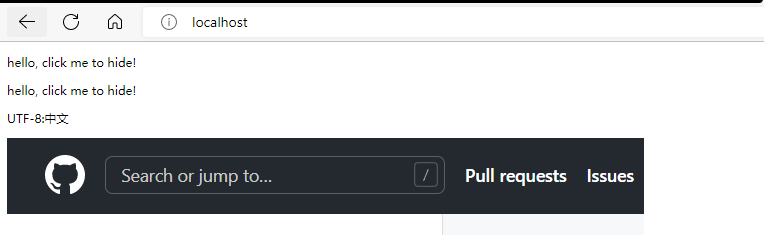

# netty-RESTful-server

基于netty、Gson和Mustache.java实现的web框架。支持：

- RESTful 使用注解方式组织URL路由
- WebSocket
- 静态文件服务器(The static file servers)
- 支持Mustache模板引擎
- 支持拦截器
- 支持restful proxy
- 支持静态文件自定义处理

示例代码在[com.github.zhizuqiu.example](src/main/java/com/github/zhizuqiu/example)包下。
其中：
- ServerTest  程序入口类
- RestHandler  类似于spring mvc中的Controller类
- TestMessage  用于测试的javabean
- WebSocketFrameHandler websocket示例
- template 模板参数对象所在的包
- interceptor 拦截器

更多示例请转到 `example` 分支

Run
---

```
private static InternalLogger logger = InternalLoggerFactory.getInstance(NettyRestServer.class);

private static final boolean SSL = false;
private static final int PORT = 80;
private static final int BOSSTHREADCOUNT = 2;
private static final int WORKTHREADCOUNT = 4;

public static void main(String[] args) {
    NettyRestServer nettyRestServer = new NettyRestServer.NettyRestServerBuilder()
            .setSsl(SSL)
            .setPort(PORT)
            .setBossThreadCount(BOSSTHREADCOUNT)
            .setWorkThreadCount(WORKTHREADCOUNT)
            .setPackages("com.github.zhizuqiu.example")
            .setStaticFilePath("resources")
            .setWebsocketHandler("/echo", WebSocketFrameHandler.class)
            .setRestCallback((bossGroup, workerGroup) -> logger.info("callback"))
            .setInterceptorBuilder(CustomInterceptorBuilder.class)
            .setRestfulPreProxy("/api", "/api2")
            .build();
    try {
        nettyRestServer.run();
    } catch (Exception e) {
        nettyRestServer.stop();
        logger.error("NettyRestServer Exception:" + e.getMessage());
    }
}
```

- setSsl 设置是否使用ssl
- setPort 设置server port
- setPackages 设置要扫描resuful handler的包路径，可设置多个
- setStaticFilePath 设置静态文件目录路径
- setWebsocketHandler 设置websocket的handler
- setBossThreadCount 设置boss线程数
- setWorkThreadCount 设置work线程数
- setRestCallback 回调返回两个线程组实例
- setInterceptorBuilder 设置拦截器
- setRestfulPreProxy 设置restful proxy

Example
---
1.RESTful

```
// 通过配置restful handler所在的包路径进行引导
.setPackages("com.github.zhizuqiu.example")

// 定义handler
@HttpMap(path = "/postJson",
        paramType = HttpMap.ParamType.JSON,
        returnType = HttpMap.ReturnType.JSON,
        method = HttpMap.Method.POST)
public TestMessage post(String jsonParam, DefaultFullHttpResponse response) {

    System.out.printf(jsonParam);
    TestMessage param = null;
    try {
        param = new Gson().fromJson(jsonParam, TestMessage.class);
    } catch (JsonSyntaxException e) {
        response.setStatus(INTERNAL_SERVER_ERROR);
    }

    return param;
}
    
```

更多方式请看示例代码 [RestHandler.java](src/main/java/com/github/zhizuqiu/example/RestHandler.java)

2.websocket

```
// 通过配置websocket地址及其handler进行引导
.setWebsocketHandler("/echo", WebSocketFrameHandler.class)
```

定义handler: [WebSocketFrameHandler.java](src/main/java/com/github/zhizuqiu/example/WebSocketFrameHandler.java)

3.静态文件服务器
```
// 通过配置静态文件目录进行引导
.setStaticFilePath("resources")
```

4.模板引擎

java:
```
@TemplateMap(path = "/netty-restful-test.html")
public TemplateObject test() {
    return new TemplateObject(
            "netty-restful-test",
            new TemplateBody("hello, click me to hide!")
    );
}
```

模板(netty-restful-test.html)：
```
<!doctype html>
<html>
<head>
    <title>{{title}}</title>
    <script type="text/javascript" src="js/jquery-3.3.1.min.js"></script>
    <meta charset="utf-8"/>
</head>
<body>
<p>{{body.p}}</p>
<p>UTF-8:中文</p>

<script>
    $(document).ready(function () {
        // 测试注释
        $("p").click(function () {
            $(this).hide();
        });
    });
</script>
</body>
</html>
```

解析如下：



5.拦截器

```
// 通过配置InterceptorBuilder进行引导
.setInterceptorBuilder(CustomInterceptorBuilder.class)
```

包括前置和后置拦截器

实现 [AbstractInterceptor](src/main/java/com/github/zhizuqiu/nettyrestfulserver/interceptor/AbstractInterceptor.java) 抽象类，来定义拦截器

实现 [InterceptorBuilder](src/main/java/com/github/zhizuqiu/nettyrestfulserver/interceptor/InterceptorBuilder.java) 接口，来装配拦截器

详见示例 [CustomInterceptorBuilder.java](src/main/java/com/github/zhizuqiu/example/interceptor/CustomInterceptorBuilder.java)

6.restful proxy

```
// 通过配置路径前缀进行引导
.setRestfulPreProxy("/api", "/api2")
```

如果`HttpHandler`中有路径`/getData`，则可以通过以下三种路径进行访问：

- /getData
- /api/getData
- /api2/getData

Install
---
1.download this lib

2.add this lib to your mvn repository.

```
mvn install:install-file -Dfile=netty-restful-server-2.0-SNAPSHOT.jar -DgroupId=com.github.zhizuqiu -DartifactId=netty-restful-server -Dversion=2.0-SNAPSHOT -Dpackaging=jar
```

3.and include dependencies:

```
<dependency>
    <groupId>com.github.zhizuqiu</groupId>
    <artifactId>netty-restful-server</artifactId>
    <version>2.0-SNAPSHOT</version>
</dependency>
```
